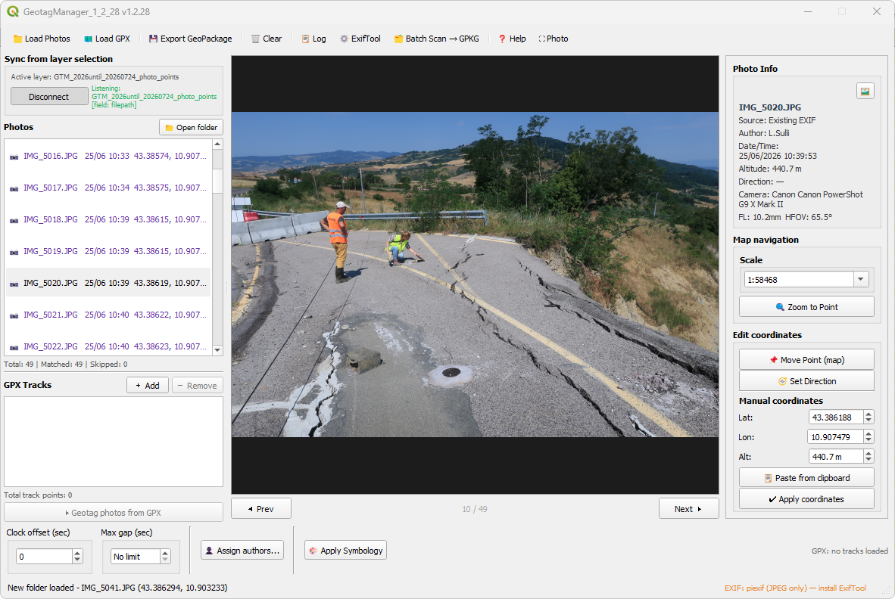

# GeotagManager — QGIS Plugin

**Version 1.2.9** | QGIS 3.x | Windows / macOS / Linux

A QGIS plugin to geotag photos from GPX tracks, manage GPS metadata, and export geolocated photo point layers.

---

## Table of Contents

1. [Installation](#installation)
2. [Interface Overview](#interface-overview)
3. [Workflow](#workflow)
4. [Features](#features)
   - [Load Photos](#load-photos)
   - [Load GPX Tracks](#load-gpx-tracks)
   - [Geotag from GPX](#geotag-from-gpx)
   - [Sync from Layer](#sync-from-layer)
   - [Edit Coordinates](#edit-coordinates)
   - [Set Direction](#set-direction)
   - [Export GeoPackage](#export-geopackage)
   - [Assign Authors](#assign-authors)
   - [Batch Scan](#batch-scan)
5. [ExifTool Setup](#exiftool-setup)
6. [GeoPackage Schema](#geopackage-schema)
7. [Keyboard Shortcuts](#keyboard-shortcuts)
8. [Troubleshooting](#troubleshooting)

---

## Installation

1. Download the latest `.zip` from the [Releases](https://github.com/) page
2. In QGIS: **Plugins → Manage and Install Plugins → Install from ZIP**
3. Select the downloaded zip and click **Install Plugin**
4. Enable the plugin in the Installed tab
5. The plugin opens via **Plugins → GeotagManager** or the toolbar icon

> **ExifTool required** for GPX geotagging and EXIF writing.
> Install it from the plugin toolbar: **⚙ ExifTool → Download ExifTool**

---

## Interface Overview



*GeotagManager v1.2.29 — interface showing a connected layer with 49 geotagged photos*

---

## Workflow

### Standard geotagging workflow

```
1. Load Folder        →  select the folder containing your photos
2. Load GPX           →  load one or more GPX tracks from the same session
3. Set Clock Offset   →  correct camera clock drift (seconds)
4. Geotag from GPX    →  match photos to trackpoints by timestamp
5. Review results     →  green = matched, orange = not matched
6. Export GeoPackage  →  save a point layer with all metadata
```

### Layer-based inspection workflow

```
1. Load a point layer  →  Connect via "Sync from layer selection"
2. Click a point       →  plugin auto-loads the photo folder and shows preview
3. Inspect metadata    →  Photo Info panel shows EXIF data from file
4. Edit if needed      →  Move Point or manual coordinates
```

---

## Features

### Load Photos

Click **📁 Load Folder** in the toolbar. The plugin scans the folder recursively for JPEG/TIFF images and reads EXIF metadata (date, GPS, camera, direction, altitude).

- Photos with existing GPS appear in **green** (source: EXIF)
- Photos without GPS appear in **orange** (source: pending)
- **📂 Open folder** button opens the folder in the system file manager

### Load GPX Tracks

Click **🗺 Load GPX** to add one or more GPX files. Multiple files are merged into a single track. The status bar shows the total number of trackpoints.

### Geotag from GPX

Click **▶ Geotag photos from GPX** (in the GPX Tracks section).

| Parameter | Description |
|---|---|
| **Clock offset (sec)** | Correction for camera clock drift. If camera is 5 min ahead: enter `-300` |
| **Max gap (sec)** | Skip photos where surrounding GPX points are more than N seconds apart. `0` = no limit |

A summary dialog shows after completion:
- ✔ Matched to GPX: N photos
- ⚠ Outside GPX time range: N photos

### Sync from Layer

Connect GeotagManager to any point layer in the QGIS project:

1. Select a layer in the TOC (Layers panel)
2. Click **Connect** in the "Sync from layer selection" section
3. The plugin auto-detects the field containing file paths (`filepath`, `location`, etc.)
4. Select any point on the map → the plugin loads the photo and shows it in the preview

**On connect:**
- The plugin adds an **"Open photo"** action to the layer (accessible from the attribute table)
- If "Apply layer symbology" is checked, green/red symbology is applied automatically

### Edit Coordinates

With a photo selected in the list:

**📌 Move Point (map)** — Click on the QGIS map canvas to assign GPS coordinates.
- Works with multiple photos selected (Shift+click): click sequentially to position each photo
- Updates: photo rubber band, layer feature geometry, layer attributes, EXIF (with confirmation)

**🧭 Set Direction** — Available only for photos with GPS coordinates.
- The camera position is pre-filled from the photo GPS
- Click once on the map to indicate the subject/target
- The azimuth from North is computed automatically and written to EXIF

**Manual coordinates** — Type Lat/Lon/Alt directly into the spinboxes, then click **✔ Apply coordinates**.

**✏ Write EXIF to file** — Writes GPS coordinates of all matched photos to their original EXIF tags (batch, with confirmation).

### Set Direction

The direction tool computes the **true azimuth** (degrees from North, clockwise) from the camera position to the clicked subject point on the map, using the geodetic formula:

```
azimuth = atan2(sin(Δlon)·cos(lat2),
                cos(lat1)·sin(lat2) − sin(lat1)·cos(lat2)·cos(Δlon))
```

Result is written to:
- `GPSImgDirection` EXIF tag (True North reference)
- `direction` field in the connected layer

### Export GeoPackage

Click **💾 Export GeoPackage**.

The default filename is built from the photo dates:

| Photos | Default filename | Layer name |
|---|---|---|
| All same day | `20240226_layer.gpkg` | `20240226_photo_points` |
| Multiple dates | `Start20240226_End20240228_layer.gpkg` | `Start20240226_End20240228_photo_points` |

**☐ Write EXIF on export** — if checked, GPS coordinates are also written to the original photo files when exporting.

After export, the layer is automatically loaded into the QGIS project and zoomed to.

### Assign Authors

Click **👤 Assign authors...** (available only when a layer is connected).

- Groups all layer features by **Date (day)** or **Camera**
- Enter author names for each group
- Features that already have an author are not modified
- Updates the `author` field directly in the connected layer

### Batch Scan

Click **🗂 Batch Scan → GPKG** to open the Batch Scan window.

Scans a directory tree for geotagged photos and exports a GeoPackage without loading photos into the session. Useful for large collections.

---

## ExifTool Setup

GeotagManager bundles ExifTool for writing EXIF tags and GPX geotagging.

1. Click **⚙ ExifTool** in the toolbar
2. Click **⬇ Download ExifTool**
3. The binary is installed in the plugin's `vendor/` folder — no system installation required

The status bar shows the active engine:
- 🟢 `EXIF: ExifTool 13.54 (bundled)` — full functionality
- 🟠 `EXIF: piexif (JPEG only)` — limited (no GPX geotagging)

---

## GeoPackage Schema

| Field | Type | Description |
|---|---|---|
| `filename` | String | Photo filename |
| `filepath` | String | Full path to the original file |
| `author` | String | Author assigned via AuthorDialog |
| `datetime_photo` | String | Date/time from EXIF (`YYYY:MM:DD HH:MM:SS`) |
| `photo_date` | Date | Date only (for temporal filtering in QGIS) |
| `latitude` | Double | WGS84 latitude |
| `longitude` | Double | WGS84 longitude |
| `altitude` | Double | Altitude in metres |
| `direction` | Double | Camera azimuth 0–360° (True North) |
| `pdop` | Double | GPS dilution of precision |
| `focal_length` | Double | Focal length in mm |
| `focal_length_35mm` | Double | 35mm equivalent focal length |
| `hfov` | Double | Horizontal field of view in degrees |
| `camera` | String | Camera make + model |
| `satellites` | Integer | Number of GPS satellites |
| `source` | String | `gpx`, `exif`, `manual`, `pending` |
| `notes` | String | Free text notes |

---

## Keyboard Shortcuts

| Key | Action |
|---|---|
| `Esc` | Cancel active map tool (Move Point, Set Direction) |
| `Shift+click` | Multi-select photos in the list |
| `Ctrl+click` | Add/remove individual photos from selection |

---

## Troubleshooting

**Plugin does not load**
Check the QGIS Python console for import errors. Reinstall the plugin if needed.

**"ExifTool not found" — orange label**
Open ⚙ ExifTool and click Download. Make sure the `vendor/` folder contains `exiftool.exe` and the `exiftool_files/` folder (Windows).

**Photos not matched after Geotag**
- Check the clock offset: compare a photo timestamp with the GPX track time
- Increase Max gap if the GPS had dropouts
- Verify the GPX file covers the same time period as the photos

**Layer not loading after Export**
The GeoPackage file was created correctly. Open it manually via **Layer → Add Layer → Add Vector Layer** and select the `.gpkg` file.

**Open Folder button is greyed out**
Load a photo folder first using **📁 Load Folder** or connect a layer that triggers auto-loading.

**Move Point does not update the layer**
The layer must be connected via "Sync from layer selection" and must have `filepath`, `latitude`, `longitude` fields.

---

## License

GeotagManager is released under the GNU GPL v2 or later.  
ExifTool is © Phil Harvey, licensed under the Artistic License / GPL.

